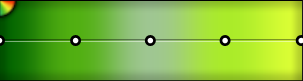
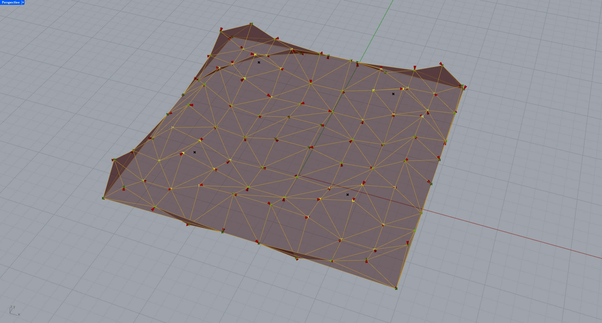
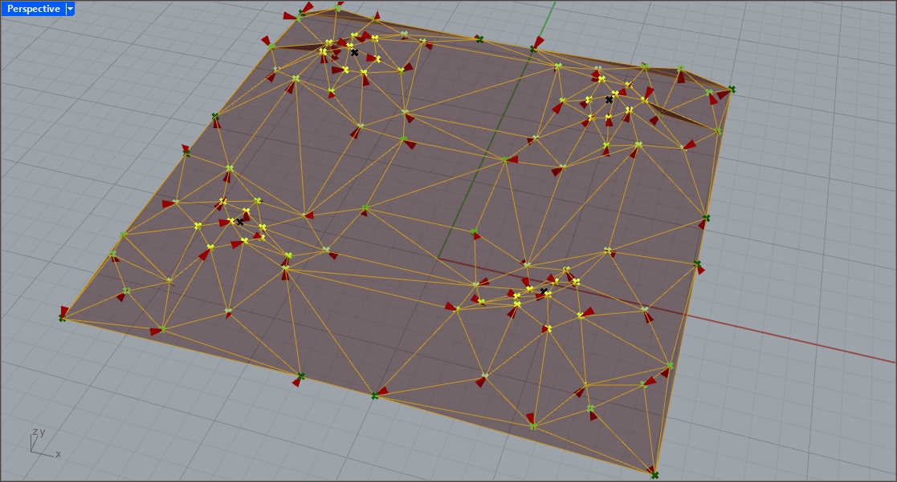
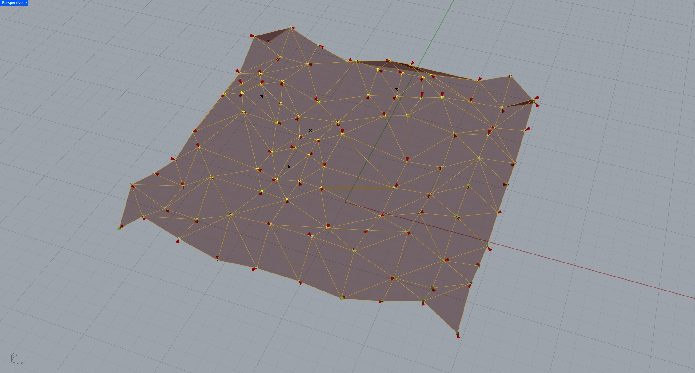
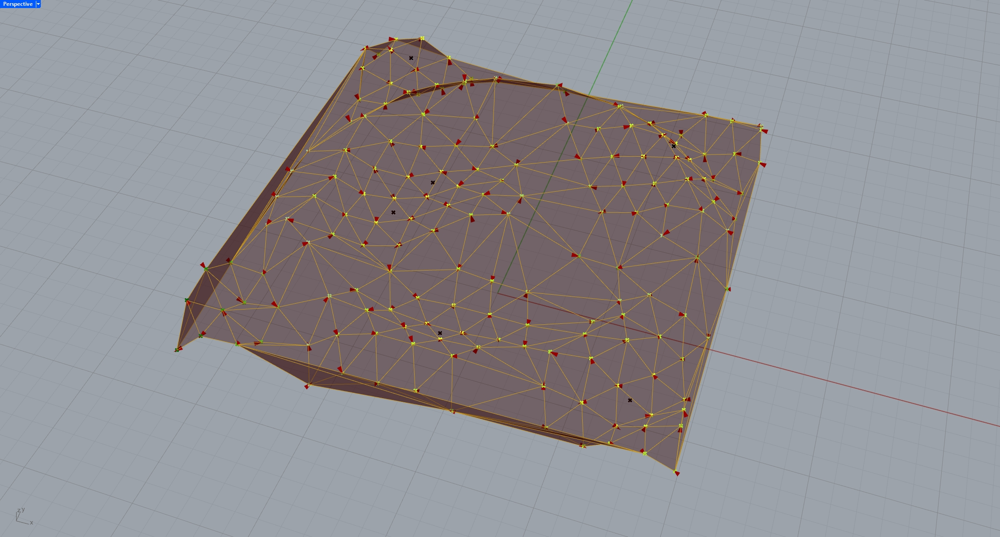

# Assignment 4: Agent-Based Model Documentation

## Table of Contents

- [Pseudo-Code](#pseudo-code)
- [Technical Explanation](#technical-explanation)
- [Design Variations](#design-variations)
- [Challenges and Solutions](#challenges-and-solutions)
- [References](#references)

---

## Pseudo-Code

1. **Main Simulation Loop**

   - **Initialize Agents**:
     - Create instances of the Agent class with initial positions and velocities, and the surface they should adhere to.
   - **Simulation Steps**:
     - For each time step:
       - **Agent Moevemnt**:
         - Agents update their positions based on their velocities. 
         - Makes sure the agents are locked to the surface geometry
       - **Agent Movement**:
         -  Agents interact with other agents and the environment.
         - Environment interaction:
            - The agents will move towards specified attractor points if they are within a certain radius
            - If the agents reach a smaller inner radius, stop moving closer to the attractor points
            - The intensity of this attraction force is parametric
         - Agent interaction:
            - Agents will push away from eachother if the are withing a certain raidus. 
            - The intensity of this repulsion force is parametric
       - **Agent State Updates**:
         - Agents will update their velocity by a small variable amount to simulate slightly erratic movement
       - **Data Collection**:
         - Record agent positions and velocity

2. **Agent Class**

   - **Attributes**:
     - position: The agent's position in space.
     - velocity: The agent's velocity vector.
     - surface: The surface the agent belongs to

   - **Methods**:
     - **move(agents)**:
       - Updates the agent's position based on its velocity, while making sure it stays on the coupled surface.
     - **interact(agents)**:
        - **Attributes**:
          - attractors: Points to which the agents are attracted.
          - attract_force: The intensity of which the agents are attracted to the attractor points.
          - repulse_force: The intensity of which the agents are repulsed by each other.
          - surface: The surface on which the agent is confined.
          - max_attract_distance: Radius of the area of effect for the attraction of agents. I.E. Agents outside of this distance are not affect by attraction.
          - repulse_radius: Radius of area of effect for the repulsion of agents. I.E. Agents outside of this distance are not affect by repulsion.
     - **update(agents)**:
       - Updates the agent's internal state after interactions and movement.
       - Add noise in the agent velocity to simulate erratic movement.

3. **Output**
   - **Positions**:
     - The agents final position after all steps.
   - **Mesh**:
     - The agents final velocity after all steps.
   - **Mesh**:
     - Generate a mesh from the final agent postitions.
   - **Mesh Edges**:
     - Generate lines for each mesh cell.

4. **Other**
   - **Attractors**:
     - Attractors can be chosen to be random or specifed at desired points.
   - **Visualization**:
     - Final agent positions should be colored depending on how close they are to the attractor points

---

## Technical Explanation

- **Object-Oriented Design**

  - Designed a class of Agents
  - The class encapsules the following information:
      - Agent positions.
      - Agent velocities.
      - Agent surface.
  - The class can alter the agents in the following ways:
      - Move the agent to a new positions.
      - Alter agent behavior depending on attractor points or other agents.
      - Simulate erratic movement.
      - These agent properties are inheritated between functions to get continuity between the agent behaviours.
  - These properties will allow the class to change agent postions based on user input preferences.
  - When the agent behaviour gets simulated they will be able to be affected with a certain amount of steps, so it is possible to trace how the agents went from the initial position to their final position.

- **Agent Behaviors and Interactions**

  - The agents can behave in following ways:
     - **Move**:
       - The agent will update it's own postion by it's current velocity for the step.
       - When generating the agents new position, `surface.ClosesPoint()` was utilized to make sure the agent stays on the surface.
     - **Interact**:
       - The agents are affected by the environment with attractor logic.
       - The attractor logic has the following parameters:
          - `attractors`: Points to which the agents are attracted (Point3dList).
              - The attractor points are either chosen randomly on the surface or are chosen at specified points.
              - In this code the specified points were chosen to be above where the supports for the surface would be.
          - `attract_force`: The intensity of which the agents are attracted to the attractor points (float).
          - `surface`: The surface on which the agent is confined. (NurbsSurface)
          - `max_attract_distance`: Radius of the area of effect for the attraction of agents. I.E. Agents outside of this distance are not affect by attraction (float).
          - `attraction_radius`: Radius of the distance from the attractor point, where attraction no longer affects the agents.
       - The repulsion logic has the following parameters:
          - `repulse_force`: The intensity of which the agents are repulsed by each other (float).
          - `surface`: The surface on which the agent is confined. (NurbsSurface)
          - `repulse_radius`: Radius of area of effect for the repulsion of agents. I.E. Agents outside of this distance are not affect by repulsion (float).
       - Once the velocities for each agent has been calculated i reference to their impact by the attraction and repulsion logic, updates the agents velocities
     - **Update**:
       - Adds some noise to the agent velocity to simulate erratic movement. Done by using random to impact the velocity in a set interval.

- **Simulation Loop**

  - Before initializing the simulation define the number of agents desired, and the amount of steps that the simulation should run over.
  - Then distributes the agents along the surface in an evenly spaced manner.
  - For each step the simulation will first:
    - run the **interact** function in the Agent class one time.
    - **move** the agent postion one time. 
    - **update** the agent postion by the randomly rolled noise.
    - start over until all three effects have been gone through by n amount of steps. 

- **Visualization**

  - Extract each agent position and velocity after simulation has ended, and define them as Point3d for visualisation in Rhino.
  - using **Scipy** generate a Delaunay mesh from the point based of Delaunay triangulation.
  - Extract the mesh lines from mesh.
  - Output everything to Rhino
  - use Grasshopper components to color the agent end positions depending on how close they are to the attractor points.

---

## Design Variations

The variants all have their final agent positions colored from this gradiant:

The points will turn brighter and brighter the closer they get to the attractor points.
The attractor points themselves appear black.

1. **Variation 1: [Base Surface]**

   

   - **Parameters Changed**:
     - Num_agents: [100]
     - Num_steps: [1]
     - Attractors: [Support]
     - Attraction_radius: [1]
     - max_attract_distance: [6]
     - repulse_radius: [1.24]
     - repulse_force: [0.1]
     - Attract_force: [0.2]

   - **Description**:
     - This is how the tessallation looks with the agents in their initial postion.

2. **Variation 2: [Surface Support Attractors 40 Steps]**

  

   - **Parameters Changed**:
     - Num_agents: [100]
     - Num_steps: [40]
     - Attractors: [Support]
     - Attraction_radius: [1]
     - max_attract_distance: [6]
     - repulse_radius: [1.24]
     - repulse_force: [0.1]
     - Attract_force: [0.2]

   - **Description**:
     - This is how the tessallation looks after 40 steps with the above parameters.

3. **Variation 3: [Surface Random Attractors 70 Steps]**

  

   - **Parameters Changed**:
     - Num_agents: [100]
     - Num_steps: [70]
     - Attractors: [Random] Amount: [4]
     - Attraction_radius: [2]
     - max_attract_distance: [5]
     - repulse_radius: [1.5]
     - repulse_force: [0.05]
     - Attract_force: [0.1]

   - **Description**:
     - This is how the tessallation looks after 70 steps with the above parameters.

4. **Variation 4: [Surface Random Attractors 100 Steps]**

  

   - **Parameters Changed**:
     - Num_agents: [180]
     - Num_steps: [100]
     - Attractors: [Random] Amount: [6]
     - Attraction_radius: [1]
     - max_attract_distance: [6.5]
     - repulse_radius: [1.5]
     - repulse_force: [0.2]
     - Attract_force: [0.1]

   - **Description**:
     - This is how the tessallation looks after 100 steps with the above parameters.

---

## Challenges and Solutions

- **Challenge 1**: Initial agents clumping together in the top left coner of the surface.
  - **Solution**: Initialze a grid and spread out the agents amongst the grid.

- **Challenge 2**: Agents getting stuck or clustering unnaturally.
  - **Solution**: Adjusted interaction rules and added repulsion to prevent overlap.

- **Challenge 3**: Visualizing the simulation in real-time.
  - **Solution**: Added a trigger to run the script at certain intervals (now removed).

- **Challenge 4**: Incorrect number of agents rendering after being updated.
  - **Solution**: Agents seemed to only be updated into specific spots. Rewrote logic to spread them out.

- **Challenge 5**: Agents are moving out of the surface geometry.
  - **Solution**: Make sure agents are moved back to the surface after each movement.

- **Challenge 6**: When generating the mesh from the agents, the edges cluster together and create discontinuity in the mesh.
  - **Solution**: Switched to Delaunay mesh generation instead.

- **Challenge 7**: Add colors to points depending on their distance to attractor points.
  - **Solution**: Used grasshopper components to find the distance between agents and attractor points, and added those values to a color gradiant.

- **Challenge 8**: Points colors are incorrect.
  - **Solution**: Attractor distance only considered one of the attractor points, swapped to python component instead to only use the minimum distance for each agent.

- **Challenge 9**: Certain mesh configurations seem to not allign entirely with the mesh lines.
  - **Solution**: Not entire solved. Only seems to appear with a certain number of agents/steps. Hard to replicate. Not always apparent.

---

## References

*(List any resources you used or found helpful during the assignment.)*

- **Object-Oriented Programming**

  - [Python Official Documentation](https://docs.python.org/3/tutorial/classes.html)
  - [Real Python - OOP in Python](https://realpython.com/python3-object-oriented-programming/)

- **Agent-Based Modeling**

  - [Mesa: Agent-Based Modeling in Python](https://mesa.readthedocs.io/stable/getting_started.html)

- **Visualization Tools**

  - [Rhino.Python Guides](https://developer.rhino3d.com/guides/rhinopython/)
  - [Scipy for tessallation](https://scipy.org/)

- **General knowledge/questions**

  - [Lecture slides]
  - [Chat-GPT](https://chatgpt.com/)
  - [Refacotring guru](https://refactoring.guru/)

---

*(Feel free to expand upon these sections to fully capture your work and learning process.)*

---
